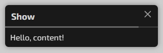
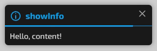
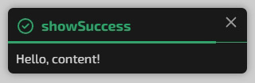
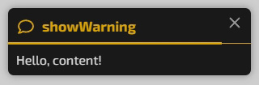
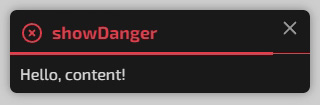

# Notify

Notify - is a simple and lightweight JS plugin for displaying notifications.
<br>
<br>

[Документація українською](README_UA.md)

## Demo

[See demo](https://ori4510.github.io/notify/)
<br>
<br>

## Features

* Easy setup
* 5 types of notifications
* 2 notification modes: short and extended (title + content)
* Dark, light and colored themes
* Indicator of the duration of the notification display
* 10 icons included

### Settings

* Notification title
* Notification content
* Duration
* Notification title color and/or background color
* Light theme
* Ability to display icons
* 2 styles of notification duration indicator
<br>

## Installation

Connect the CSS file to the HTML page.

```html
<link rel="stylesheet" href="src/notify.min.css">
```

Connect the plugin before the closing </body> tag on the HTML page.

```html
<script src="src/notify.min.js"></script>
```
<br>

## Documentation

An example of calling a message

```javascript
Notify({
	title: 'Notification title',
	content: 'Notification content',
	icon: 'message',
	duration: 5,
	lightTheme: true,
	coloredBackground: 'all',
	bottomCloseTimeline: true,
}).show();
```
<br>

### Basic message



```javascript
Notify({
	title: 'Notification title',
	content: 'Notification content',
	icon: 'info',
}).show();
```
<br>

### Info message



```javascript
Notify({
	title: 'Notification title',
	content: 'Notification content',
	icon: 'info',
}).showInfo();
```
<br>

### Success message



```javascript
Notify({
	title: 'Notification title',
	content: 'Notification content',
	icon: 'info',
}).showSuccess();
```
<br>

### Warning message



```javascript
Notify({
	title: 'Notification title',
	content: 'Notification content',
	icon: 'info',
}).showWarning();
```
<br>

### Danger message



```javascript
Notify({
	title: 'Notification title',
	content: 'Notification content',
	icon: 'info',
}).showDanger();
```
<br>

### Title

title - the title of the message. Support for HTML tags.

> **Type**: string

```javascript
title: 'Some title'
```
<br>

### Content

content - the main text of the message. Support for HTML tags.

> **Type**: string

```javascript
content: 'Some text'
```
<br>

### Display time

duration - the time the message is displayed in seconds.

> **Type**: integer

> **Default**: 5 sec

```javascript
duration: 5
```
<br>

### Light theme

lightTheme - enable the light theme. Ignored if `Colored background` is enabled

> **Type**: boolean

> **Default**: false

**Possible values**: true | false

```javascript
lightTheme: true
```
<br>

### Short message mode

shortMode - enable the short message mode. The `content` option will be ignored.

> **Type**: boolean

> **Default**: false

**Possible values**: true | false

```javascript
shortMode: true
```
<br>

### Colored background

coloredBackground - turn on the color background mode of the message. You can choose a colored background for the header or for the entire message.

> **Type**: boolean | string

> **Default**: false

**Possible values**: title | all | false

```javascript
coloredBackground: 'title'
```
<br>

### Indicator of the duration of the notification display

hideCloseTimeline - turn off the indicator of the message display duration.

> **Type**: boolean

> **Default**: false

**Possible values**: true | false

```javascript
hideCloseTimeline: true
```
<br>

### Placement of the notification display duration indicator

bottomCloseTimeline - move the message display duration indicator to the bottom of the message.

> **Type**: boolean

> **Default**: false

**Possible values**: true | false

```javascript
bottomCloseTimeline: true
```
<br>

### Icons

icon - the ability to display one of 10 integrated icons.

> **Type**: string

> **Default**: null

**Possible values**: 'ok' | 'no' | 'info' | 'like' | 'heart' | 'email' | 'calendar' | 'question' | 'message' | 'chat'

| icon text | icon image |
| -------- | ------- |
| ok |  |
| no |  |
| info |  |
| like |  |
| heart |  |
| email |  |
| calendar |  |
| question |  |
| message |  |
| chat |  |

```javascript
icon: 'info'
```
<br>

### Font

The font for notifications is not specified and will be inherited from the body.
If you want to specify a different font for notifications, you can do it in CSS:
```css
.dom-notify {
	font-family: 'My Font';
}
```
<br>

## License

MIT license