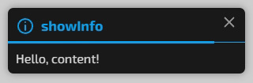
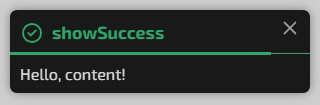
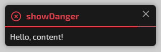

# Notify

Notify - це простий та легкий JS-плагін для відображення сповіщень.
<br>
<br>

## Demo

[Дивитись demo](https://ori4510.github.io/notify/)
<br>
<br>

## Особливості

* Просте налаштування
* 5 типів сповіщень
* 2 режими сповіщень: короткі та розширені (заголовок + вміст)
* Темна, світла та кольорова теми
* Індикатор тривалості відображення сповіщення
* 10 іконок у комплекті

### Налаштування

* Заголовок сповіщення
* Контент сповіщення
* Тривалість
* Колір заголовка сповіщення та/або колір фону
* Світла тема
* Можливість відображення іконок
* 2 стилі індикатора тривалості відображення сповіщення
<br>

## Установка

Підключіть CSS-файл до HTML-сторінки.

```html
<link rel="stylesheet" href="src/notify.min.css">
```

Підключіть плагін перед закриваючим тегом </body> на HTML-сторінці.

```html
<script src="src/notify.min.js"></script>
```
<br>

## Документація

Приклад виклику повідомлення

```javascript
Notify({
	title: 'Notification title',
	content: 'Notification content',
	icon: 'message',
	duration: 5,
	lightTheme: true,
	coloredBackground: 'all',
	bottomCloseTimeline: true,
}).show();
```
<br>

### Базове повідомлення


```javascript
Notify({
	title: 'Notification title',
	content: 'Notification content',
	icon: 'info',
}).show();
```
<br>

### Info повідомлення



```javascript
Notify({
	title: 'Notification title',
	content: 'Notification content',
	icon: 'info',
}).showInfo();
```
<br>

### Success повідомлення



```javascript
Notify({
	title: 'Notification title',
	content: 'Notification content',
	icon: 'info',
}).showSuccess();
```
<br>

### Warning повідомлення


```javascript
Notify({
	title: 'Notification title',
	content: 'Notification content',
	icon: 'info',
}).showWarning();
```
<br>

### Danger повідомлення



```javascript
Notify({
	title: 'Notification title',
	content: 'Notification content',
	icon: 'info',
}).showDanger();
```
<br>

### Заголовок

title - заголовок повідомлення. Підтримка HTML-тегів.

> **Тип**: string

```javascript
title: 'Some title'
```
<br>

### Контент

content - основний текст повідомлення. Підтримка HTML-тегів.

> **Тип**: string

```javascript
content: 'Some text'
```
<br>

### Час відображення

duration - час показу повідомлення в секундах.

> **Тип**: integer

> **Default**: 5 сек

```javascript
duration: 5
```
<br>

### Світла тема

lightTheme - включити світлу тему. Ігнорується якщо включено `Кольоровий фон`

> **Тип**: boolean

> **Default**: false

**Можливі значення**: true | false

```javascript
lightTheme: true
```
<br>

### Режим коротких повідомлень

shortMode - включити режим коротких повідомлень. Опція `content` буде проігнорована.

> **Тип**: boolean

> **Default**: false

**Можливі значення**: true | false

```javascript
shortMode: true
```
<br>

### Кольоровий фон

coloredBackground - включити режим кольорового фону повідомлення. Можна вибрати кольоровий фон для заголовка або для всього повідомлення.

> **Тип**: boolean | string

> **Default**: false

**Можливі значення**: title | all | false

```javascript
coloredBackground: 'title'
```
<br>

### Індикатор тривалості відображення сповіщення

hideCloseTimeline - вимкнути індикатор тривалості відображення повідомлення.

> **Тип**: boolean

> **Default**: false

**Можливі значення**: true | false

```javascript
hideCloseTimeline: true
```
<br>

### Розміщення індикатора тривалості відображення сповіщення

bottomCloseTimeline - перемістити індикатор тривалості відображення повідомлення в нижню частину повідомлення.

> **Тип**: boolean

> **Default**: false

**Можливі значення**: true | false

```javascript
bottomCloseTimeline: true
```
<br>

### Іконки

icon - можливість відобразити одну із 10 інтегрованих іконок.

> **Тип**: string

> **Default**: null

**Можливі значення**: 'ok' | 'no' | 'info' | 'like' | 'heart' | 'email' | 'calendar' | 'question' | 'message' | 'chat'

| icon text | icon image |
| -------- | ------- |
| ok |  |
| no |  |
| info |  |
| like |  |
| heart |  |
| email |  |
| calendar |  |
| question |  |
| message |  |
| chat |  |

```javascript
icon: 'info'
```
<br>

### Шрифт

Шрифт для сповіщень не прописаний, і буде наслідуватись від body.
Якщо ви хочете вказати для сповіщень інший шрифт, це можна зробити в CSS:
```css
.dom-notify {
	font-family: 'My Font';
}
```
<br>

## License

MIT license